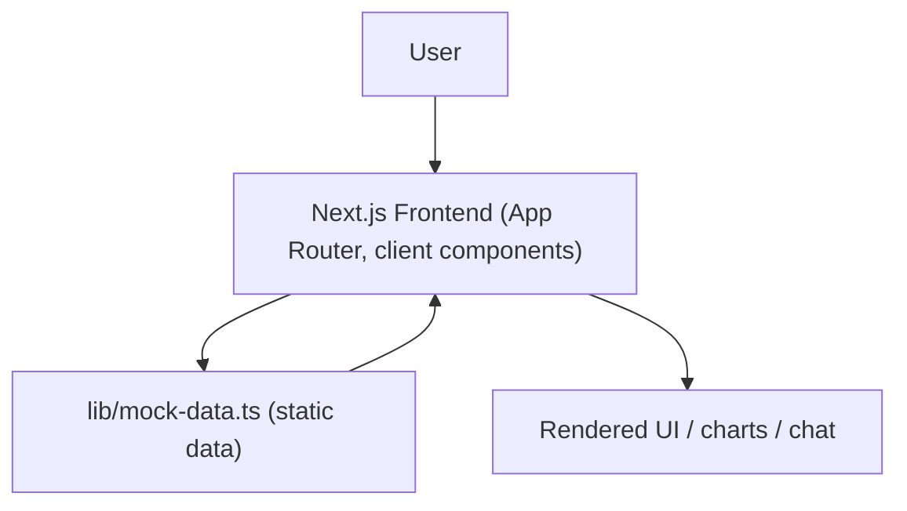

# InvestOne AI

Frontend prototype for **Securities Market TechSprint** — a unified multi-asset investment dashboard concept for Indian retail investors (stocks, mutual funds, ETFs, REITs, InvITs, bonds, gold).

> **Status: UI/UX prototype only.** Every number, chat reply, and "system" you see is hardcoded sample data in [`lib/mock-data.ts`](./lib/mock-data.ts). There is no backend, no database, no authentication, and no live AI model behind this app — see [Project Status](#project-status) for the full breakdown.

## Overview

InvestOne AI is a Next.js single-page-app-style marketing site + dashboard shell demonstrating what a consolidated investment platform could look like: a landing page, a multi-page authenticated app shell (dashboard, portfolio, risk analysis, health score, explorer, AI assistant, learning hub, goals, alerts, profile, settings, admin), and login/signup screens. All data is static and in-memory; nothing persists or leaves the browser.

## Features

Implemented (UI + client-side state only, backed by mock data):

- Landing page with feature/pricing/testimonial/FAQ sections
- Login / signup screens (client-side form state, redirect on submit — no real auth)
- Dashboard with portfolio value, allocation charts, and recent transactions (Recharts)
- Portfolio holdings list with search, filter, and per-asset-type tabs (read-only, no buy/sell)
- Risk analysis, health score, and goals pages
- Investment explorer (browse/filter a static catalogue of assets)
- "AI Assistant" chat UI — canned responses from a hardcoded lookup table keyed by exact question text, with a scripted fallback message; **no real LLM call is made**
- Alerts/notifications list with read/unread and tab filtering (local state only)
- Learning hub with modules, progress bars, and badges
- Profile, settings (dark mode, notification toggles — local state only), and admin pages

Not implemented:

- Any backend, API route, or database
- Real authentication/authorization (all routes are publicly navigable, including `/admin`)
- Real AI/LLM integration (the AI Assistant's "Powered by Gemini AI" label in the UI does not reflect an actual API call)
- Buy/sell or any account-linking functionality (by design — the signup copy describes the product as "a read-only aggregation platform")
- Data persistence of any kind (refreshing the page resets all in-session changes)

## Architecture

```
User (browser)
      │
      ▼
Next.js 16 App Router (client components, "use client")
      │
      ▼
lib/mock-data.ts  (static in-memory arrays/objects)
      │
      ▼
React state (useState) → re-render → UI
```

There is no network hop after the initial page load: `next build` prerenders every route as static HTML (see [Build](#build)), and no page issues `fetch`/`axios` calls or reads `process.env`. It is a fully client-side, static application.



### Frontend
Next.js 16 (App Router) + React 19 + TypeScript, Tailwind CSS v4, Radix UI primitives with a shadcn/ui-style component layer, Recharts for charts, Framer Motion for animation.

### Backend / API
None. No `app/api` directory, no server actions performing I/O, no middleware.

### Database
None. No ORM, driver, or connection string anywhere in the codebase.

### External APIs / AI services
None called at runtime. The "AI Assistant" page displays "Powered by Gemini AI" in its copy, but this is UI text only — responses come from a hardcoded `Record<string, string>` in `lib/mock-data.ts`, with a generic templated fallback for unrecognized questions.

## Tech Stack

| Layer | Technology |
|---|---|
| Frontend framework | Next.js 16.3.0 (App Router, Turbopack), React 19.2.4, TypeScript 5 |
| Styling | Tailwind CSS v4 (`@tailwindcss/postcss`), CSS custom properties for theming |
| UI components | Radix UI primitives + shadcn/ui-style wrappers (`components/ui/`), `class-variance-authority`, `tailwind-merge` |
| Charts | Recharts |
| Animation | Framer Motion |
| Icons | Lucide React |
| Backend | None |
| Database | None |
| Authentication | None (client-side form redirect only) |
| AI/ML | None (static canned responses) |
| Deployment | Vercel (see [Deployment](#deployment)) |
| Testing | None configured (no test runner/framework in `package.json`) |

## Repository Structure

```
Securities-Market-TechSprint/
├── README.md                  # Root repo overview
└── investone-ai/               # This app — the only code in the repo
    ├── app/
    │   ├── (auth)/              # login, signup — no shared layout guard
    │   ├── (app)/               # dashboard, portfolio, ai-assistant, explorer,
    │   │                        # risk-analysis, health-score, goals, alerts,
    │   │                        # learning, profile, settings, admin
    │   │   └── layout.tsx       # Sidebar + TopBar shell
    │   ├── layout.tsx           # Root layout, global metadata
    │   ├── page.tsx             # Landing page
    │   └── globals.css          # Design tokens (light/dark) + Tailwind import
    ├── components/
    │   ├── ui/                  # Base primitives: button, card, input, dialog, ...
    │   └── shared/               # Sidebar, TopBar, AnimatedNumber, LoadingSkeleton
    ├── lib/
    │   ├── mock-data.ts          # All application data — the single source of truth
    │   └── utils.ts               # Formatting helpers (currency, percent, date) + cn()
    ├── public/                    # Static assets (favicon only)
    ├── next.config.ts
    ├── eslint.config.mjs
    ├── tsconfig.json
    └── package.json
```

## Prerequisites

- Node.js 20+ (developed/verified on Node 24.16.0)
- npm 10+ (verified on npm 11.16.0)

## Installation

```bash
git clone https://github.com/Koushik744/Securities-Market-TechSprint.git
cd Securities-Market-TechSprint/investone-ai
npm install
```

## Environment Variables

**None required.** The codebase contains no `process.env` reads, no `NEXT_PUBLIC_*` variables, and no `.env*` files. There is nothing to configure — `npm install && npm run dev` is sufficient to run the app locally, and no environment variables need to be set in Vercel either.

If this project grows a real backend or AI integration in the future, document new variables here and add a corresponding `.env.example` at that time — do not add speculative variables before they're used in code.

## Running Locally

Single service — just the frontend:

```bash
cd investone-ai
npm run dev
```

Open [http://localhost:3000](http://localhost:3000). There is no separate backend or database to start.

## API Documentation

No backend/API endpoints exist in this repository.

| Method | Endpoint | Purpose | Auth |
|---|---|---|---|
| — | — | N/A — no `app/api` routes present | — |

## Frontend ↔ Backend Integration

There is no backend to integrate with. Every page imports static data directly from [`lib/mock-data.ts`](./lib/mock-data.ts) and mutates it only in local React state (`useState`); nothing is persisted or sent over the network. Verified via `next build` output — every route is prerendered as static content (`○ (Static)`), and a runtime network trace during manual testing showed zero requests beyond the app's own static assets and fonts.

## Database Setup

Not applicable — this project does not use a database.

## Testing

No test runner is configured (`package.json` has no `test` script and no testing library is installed). The verification performed for this audit was:

```bash
npm run lint            # ESLint — PASS, 0 errors, 0 warnings
npx tsc --noEmit         # TypeScript — PASS, 0 errors
npm run build             # Production build — PASS, all 15 routes prerendered
```

Manual functional testing (dev server + browser) confirmed every route renders without console errors, the login/signup forms redirect correctly, and the AI Assistant chat produces its canned responses correctly. See [Project Status](#project-status) for what "working" means in a mock-data-only app.

## Build

```bash
npm run build
npm run start   # serve the production build on port 3000
```

`next build` prerenders all 15 routes as static HTML/JS — there are no server-rendered or dynamic routes.

## Deployment

The frontend is intended to deploy to **Vercel** using Next.js's standard zero-config build. There is no `vercel.json` in the repo; Vercel auto-detects the Next.js app via `package.json`.

**Important:** the repository root has no `package.json` — the Next.js app lives in `investone-ai/`. For a Vercel project to build successfully, its **Root Directory** setting (Project Settings → Build & Development Settings) must be set to `investone-ai`. This is a dashboard setting, not something a committed file can configure.

The GitHub repository lists a deployment at `https://securities-market-tech-sprint.vercel.app`, but as of this audit that URL returns **`404: DEPLOYMENT_NOT_FOUND`** — the deployment does not currently exist or was deleted. See [Troubleshooting](#troubleshooting).

There is no backend or database to deploy separately — this is a static-output-capable frontend only.

## Troubleshooting

**Vercel build fails or deployment 404s**
Set the Vercel project's Root Directory to `investone-ai`. Without it, Vercel looks for `package.json` at the repo root, doesn't find one, and the build cannot start.

**"AI Assistant" gives the same generic reply to most questions**
This is expected — it's a hardcoded lookup table (`aiResponses` in `lib/mock-data.ts`) with six recognized questions and one generic fallback string. It is not calling any AI model.

**Dark mode toggle in Settings doesn't match the one in the top bar**
Known limitation: both toggles hold independent local component state (no shared theme context, no persistence), so they can disagree and reset on navigation/refresh.

**Data doesn't update / "transactions" don't actually happen**
Expected — all data is static and in-memory (`lib/mock-data.ts`). There's no backend to write to.

**`npm run build` fails with a TypeScript or ESLint error**
Run `npx tsc --noEmit` and `npm run lint` individually to isolate the failure. At the time of this audit both pass cleanly on a fresh `npm install`.

## Security

- No secrets, API keys, or credentials exist anywhere in this codebase (verified by repo-wide search) — there is nothing to leak.
- Because there is no backend or auth layer, **every route including `/admin` is publicly viewable by anyone with the URL**; there is no sensitive real data behind it today, but this should not be mistaken for an access-controlled admin panel.
- If real backend/AI/auth integrations are added later, store all credentials in environment variables (never commit them), and add `.env.example` with placeholder values only.

## Project Status

**Working** (verified during this audit):
- All 15 routes render without errors, on a fresh `npm install`
- `npm run lint`, `npx tsc --noEmit`, and `npm run build` all pass cleanly
- Navigation, forms (login/signup submit → redirect), the AI Assistant's canned chat, and all mock-data-driven pages behave as designed

**Partially working / by-design limitations:**
- Dark mode toggle state isn't shared or persisted across components/navigation
- Scroll-triggered landing-page counters depend on `IntersectionObserver`, which could not be fully exercised in this audit's headless preview environment (code review confirms a standard, correct `framer-motion` `useInView` implementation)

**Not implemented / blocked:**
- No backend, database, authentication, or real AI integration exist — this is a frontend-only prototype
- The public Vercel deployment linked from the GitHub repo is currently down (404)

This project is **not production-ready** and is not connected to any real market data, brokerage, or AI service. It is a hackathon-stage UI prototype suitable for demos, not for handling real user accounts or financial data.

## Future Improvements

Realistic next steps given the current codebase:
- Add a real backend (API routes or a separate service) and database if persistence is needed
- Wire the AI Assistant to an actual LLM API (the UI already implies Gemini) behind a server-side route so no API key is exposed client-side
- Add real authentication (e.g., NextAuth) before any route currently under `(app)/` is treated as "authenticated"
- Fix the Vercel Root Directory setting so the linked deployment resolves
- Consolidate the two independent dark-mode toggles into a single shared theme context with persistence
- Add a test suite (currently none exists)

## License

No `LICENSE` file is present in this repository. All rights reserved by the author unless a license is added.
